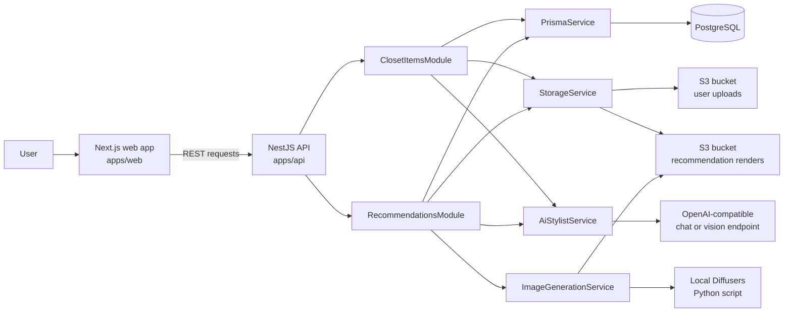
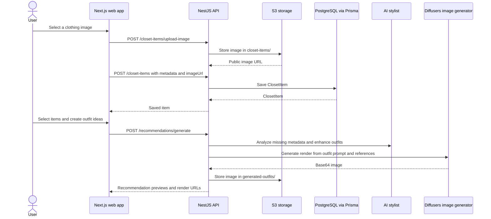
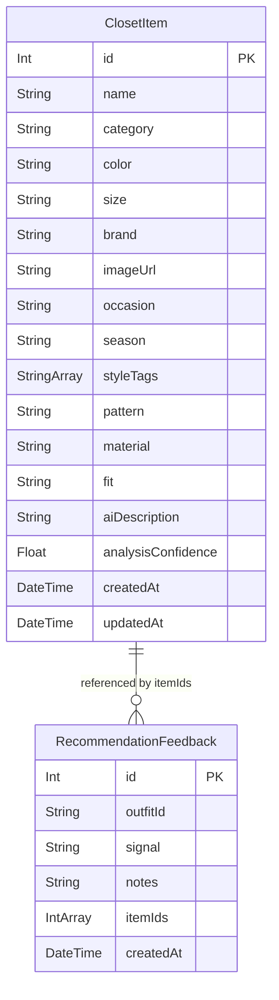

# Closet AI Platform

Closet AI is a full-stack wardrobe recommendation app. The web app lets a user upload clothing images, save closet metadata, select pieces, and generate outfit ideas. The API stores closet items, uploads images to S3, builds recommendations from closet metadata and feedback, and can enrich results with AI stylist notes and local Diffusers image renders.

## Architecture



## User Flow



## Data Model



## Workspace Layout

```text
apps/
  api/    NestJS API, Prisma schema, storage, AI, and recommendation services
  web/    Next.js client for uploading closet items and generating outfits
packages/
  shared/ Shared TypeScript package placeholder
```

## Key API Areas

| Area | Routes | Purpose |
| --- | --- | --- |
| Closet items | `GET /closet-items`, `POST /closet-items`, `POST /closet-items/upload-image`, `PATCH /closet-items/:id`, `DELETE /closet-items/:id` | Manage wardrobe items and S3 image uploads. |
| Image analysis | `POST /closet-items/:id/analyze-image` | Enrich an item with AI-generated fashion metadata. |
| Recommendations | `GET /recommendations/outfits`, `POST /recommendations/generate`, `POST /recommendations/outfits/:id/render` | Build outfits, generate render prompts, and save rendered images. |
| Generated images | `GET /recommendations/generated-items` | List generated outfit renders from S3. |
| Taste profile | `GET /recommendations/taste-profile`, `POST /recommendations/feedback` | Store feedback and derive preference signals. |

## Local Setup

Install dependencies from the repo root:

```bash
pnpm install
```

Create the API environment file:

```bash
cp apps/api/.env.example apps/api/.env
```

Set `DATABASE_URL`, S3 bucket settings, and AI settings in `apps/api/.env`. The API expects PostgreSQL through Prisma. The web app calls `http://localhost:3000` by default, or `NEXT_PUBLIC_API_BASE_URL` if set.

Generate Prisma client and push the schema:

```bash
pnpm --filter api prisma:generate
pnpm --filter api prisma:push
```

Run both apps:

```bash
pnpm dev
```

By default, the API listens on port `3000` and the web app listens on port `3001`.

## Scripts

| Command | What it does |
| --- | --- |
| `pnpm dev` | Runs app dev servers through Turborepo. |
| `pnpm build` | Builds all workspace packages with a build script. |
| `pnpm lint` | Runs workspace lint tasks. |
| `pnpm test` | Runs workspace test tasks. |
| `pnpm --filter api test` | Runs API unit tests. |
| `pnpm --filter api test:e2e` | Runs API e2e tests. |

## Notes

- Uploaded closet images are stored under `closet-items/` in the user upload S3 bucket.
- Generated outfit renders are stored under `generated-outfits/` in the recommendation S3 bucket.
- AI stylist features use an OpenAI-compatible chat completions API through `AI_BASE_URL`.
- Image rendering uses the local Diffusers Python script at `apps/api/src/image-generation/generate_with_diffusers.py`.
